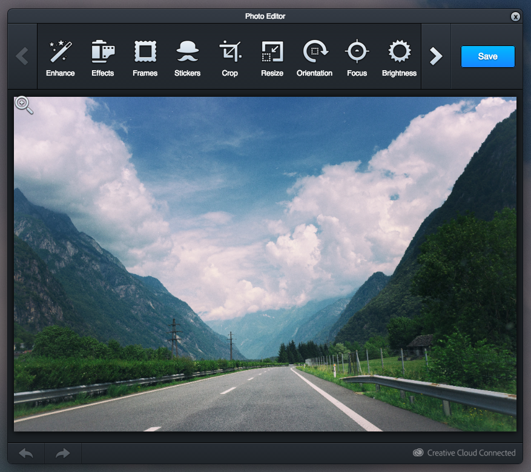
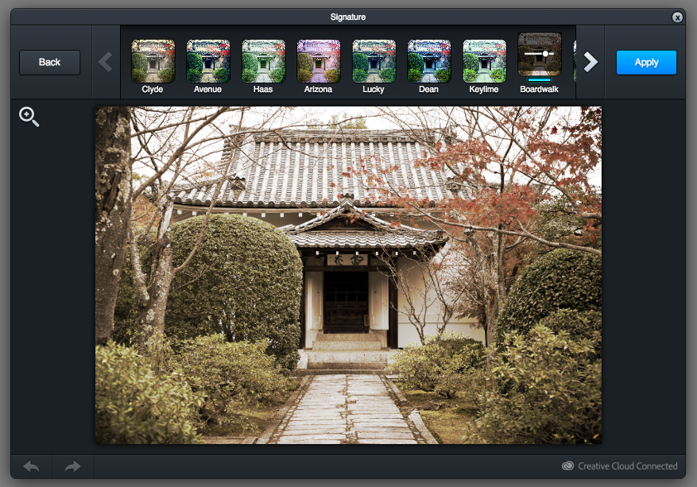

# \<creative-photo-editor\>

A Polymer web component for Adobe Creative
_[Demo and API docs](https://ingressorapidowebcomponents.github.io/components/creative-photo-editor)_

The `creative-photo-editor` is a wrapper of the best FREE Phonto Editor, Adobe Creative (https://creativesdk.adobe.com), but with fixes to works well with web components.
Maybe you will want your own api key to run in production, you can get one for FREE creating an account in https://creativesdk.adobe.com/myapps.html

Many features, customize as you want:





It's simple:
```html
    
    <creative-photo-editor
        id="example"
        api-key="1234567"
        image="imageDisplay">
    </creative-photo-editor>
```

After that, create an editor:
```js
    this.$.example.create();
```

DONE!